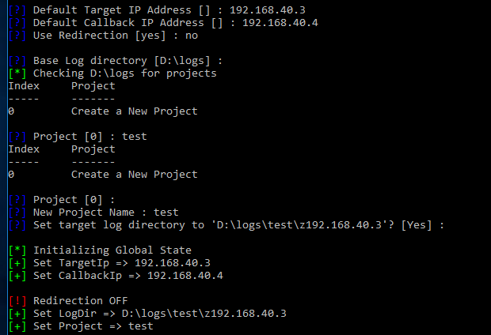
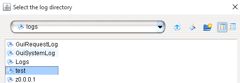
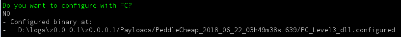
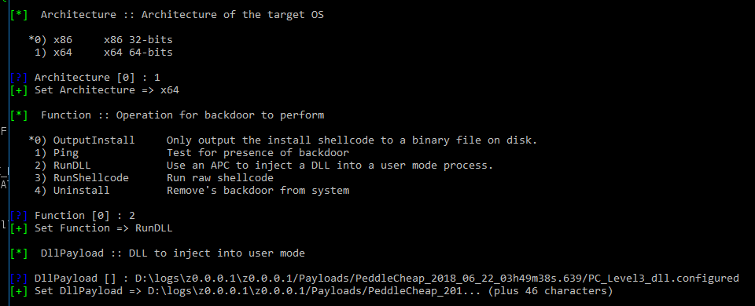
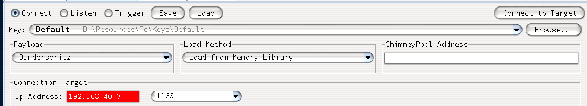
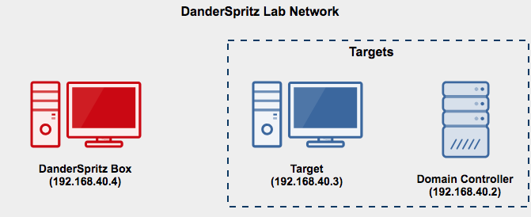

# DanderSpritz Lab

## Purpose
The goal of DanderSpritz lab is to allow researchers and defenders to quickly stand up a fully functional version of DanderSpritz - [The Equation Group's Post exploitation tool-set](https://www.youtube.com/watch?v=Zqw-T1YQKUQ) and a Windows Server 2008 Domain and client as targets. The Windows target have some reverse engineering tools that I found useful while investigating DanderSpritz and it's capabilities. 

Read a little bit about DanderSpritz lab here: https://medium.com/@francisck/introducing-danderspritz-lab-461912313d7c

A website I've created to document DanderSpritz capabilities and tools: https://danderspritz.com

NOTE: This lab has not been hardened in any way (**it is intentionally vulnerable**) and runs with default vagrant credentials. Please do not connect or bridge it to any networks you care about. 

## Requirements
* 20GB+ of free disk space
* 8GB+ of RAM
* 20GB bandwidth usage (to download ISOs, updates, service packs, etc)
* [Packer](https://www.packer.io/docs/install/index.html) v1.2.3 or newer
* [Vagrant](https://www.vagrantup.com/downloads.html) v2.1.1 or newer
* [Vagrant-Reload Plugin](https://github.com/aidanns/vagrant-reload)
* Virtualbox (_VMWare Fusion/Workstation coming **later**_)

---

## Starting DanderSpritz Lab

DanderSpritz uses Packer, Vagrant, and the Vagrant-reload plug-in to install and configure the lab from **scratch**. Packer will download Windows ISOs directly from Microsoft and install trial versions of the software for use during research. 

1. Clone this repo to your own machine
    `git clone git@github.com:francisck/DanderSpritz_lab.git`
2. Make sure you have the Vagrant-reload plug installed
    `vagrant plugin install vagrant-reload`
3. In order to download the ISOs and perform the build-out of the Vagrant boxes run the following command:
    `packer build danderspritz_lab.json`
4. Once the Vagrant boxes are built, start the VMs and let them continue some additional configuration:
    `vagrant up`

### Create a FuzzBunch project

1. Launch the Windows Command Prompt (cmd) and run the following:
    `D:\`
    `python fb.py`
2. Set a default **target** address of _192.168.40.3_
3. Set a default **callback** address of _192.168.40.4_
4. **Do not** use redirection (at first)
5. Leave the default log directory
6. Create a new project (option _0_)
7. Name your new project
8. Leave the default logs directory

### Exploit the Target Machine

1. Run the following command to exploit the machine using EternalBlue
    `use eternalblue`
2. Choose all of the default options **except** the delivery mechanism. Use "FB" (traditional deployment) as the delivery mechanism
3. Once eternalblue succeeds, configure danderspritz and peddlecheap

### Configure & Launch DanderSpritz 

1. Launch another Windows Command Prompt (cmd) and run the following:
    `D:\`
    `python configure_lp`
2. Allow Java through the firewall
3. Select `browse` next to "Log directory" and choose the name of the FuzzBunch project you created

4. Click "go"

### PeddleCheap prep (configure the implant)

1. In the DanderSpritz console, run the following command:
    `pc_prep`
2. Select the standard x64-winnt level 3 sharedlib payload
    `5`
3. Do **not** select advanced settings
4. Choose to perform an immediate callback
5. Use the default PC ID (0)
6. Select **"Yes"** to "Do you want to listen?"
7. Do **not** change listen ports
8. Leave the default "callback" address (127.0.0.1)
9. Do not change the exe name 
10. Use the default key (option 2)
11. Validate that the PeddleCheap configuration is valid
12. Do **not** configure with FC (_felonycrowbar_)
13. Copy the location of the configured binary:

### Deliver the implant (peddlecheap) via DoublePulsar backdoor:

1. In the original Fuzzbunch Window type:
    `use doublepulsar`
2. Choose "yes" when asked if you want to be prompted for variable settings
3. Select all default variable settings **except** the target architecture (choose option 1)
    `1) x64   x64 64-bits`
4. Select the "RunDLL" function (option 2)
    `2) RunDLL Use an APC to inject a DLL into a user mode process.`

5. Leave all other options default and select "Yes" when asked if you want to execute the plugin
6. You should see "Doublepulsar succeeded"

### Connect to PeddleCheap implant with DanderSpritz

1. In DanderSpritz select "PeddleCheap" at the top of the screen
2. Select the "default" key from the key dropdown menu
3. Enter the address of the target machine (192.168.40.3)
4. Select "Connect to target"

5. Select your Fuzzbunch project name
6. Wait for the [DanderSpritz Survey](https://medium.com/francisck/the-equation-groups-post-exploitation-tools-danderspritz-and-more-part-1-a1a6372435cd) to complete (will take quite a while) and you'll have to answer a few questions along the way
7. Profit!

### Use for good, not evil!

The purpose of this project is to allow *security researchers* to build and configure a fully functional DanderSpritz lab easily for reverse engineering and testing. 

* **Do not** run this against any targets outside of this lab. 
* **Do not** use this for "red team engagements"
* **Do** Contribute your research back to the community
* **Do** Reach out to [me](https://twitter.com/francisckrs) with any questions you may have :) 

### Day-to-day usage

Once you've ran packer once, you won't need to run it again. The Vagrant boxes will be available for you to rebuild, tear down, restart your lab. 

Below are some useful commands that you may use as you work with the lab:

### Basic Vagrant Usage

* Bring up all DanderSprotz Lab hosts: `vagrant up` 
* Bring up a specific host: `vagrant up <hostname>`
* Restart a specific host: `vagrant reload <hostname>`
* Restart a specific host and re-run the provision process: `vagrant reload <hostname> --provision`
* Destroy a specific host `vagrant destroy <hostname>`
* Destroy the entire Danderspritz Lab environment: `vagrant destroy`
* Snapshot a machine: `vagrant snapshot save <hostname> <snapshot_name>`
* Restore a machine snapshot: `vagrant snapshot restore <hostname> <snapshot_name>`
* Check the status of each host: `vagrant status`
* Suspend the lab environment: `vagrant suspend`
* Resume the lab environment: `vagrant resume`

### Re-arm expired Windows hosts

If you run into an issue where the test license is expired, you can re-arm the hosts up to 3 times (for 90 days of Windows license goodness) by running this command on an administrative command prompt

    `slmgr /rearm'

You'll have to reboot the machine. 

---

## Lab Information

### Lab Diagram

### Additional lab Information
* **Domain Name**: windomain.local
* **Administrator login (all machines)**: vagrant:vagrant
* **DC** (Domain Controller): 192.168.40.2/24
* **Target**: 192.168.40.3/24
* **DanderSpritz**: 192.168.40.4/24

## Lab Hosts
* DC - Windows 2008 R2 Domain Controller
  * Windows Domain Controller for Windomain.local
  * WEF Server Configuration GPO
  * Powershell logging GPO
  * Enhanced Windows Auditing policy GPO
* Target - Windows 7 Workstation
  * Simulates target workstation / machine
  * Joined to Windomain.local Windows AD Domain
  * Some reversing / visibility tools pre-installed
  * Chocolatey (with FireEye Flare REPO) available for further tool installation
* DanderSpritz Box - Windows 10 
  * DanderSprirtz & Fuzzbunch pre-installed

## Installed Tools on Target (Windows 7 SP1)
  * Sysmon
  * Sysinternal Tools (Procmon, TCPview, etc)
  * API Monitor
  * InfoPe
  * HxD
  * PEView
  * Windbg
  * WireShark
  * Binary Ninja
  * HashCalc
  * IDA 7 Free
  * Ollydbg
  * Enhanced Auditing GPO 
  * PowerShell logging GPO
  * Windows Events forwarded to Domain Controller (WEC)

---

## Credits/Resources
A sizable percentage of this code was borrowed and adapted from [Chris Long](https://twitter.com/Centurion)'s [DetectionLab](https://github.com/clong/DetectionLab) project along with [Stefan Scherer](https://twitter.com/stefscherer)'s [packer-windows](https://github.com/StefanScherer/packer-windows) and [adfs2](https://github.com/StefanScherer/adfs2) Github repos. A **huge** thanks to to everyone who has contributed their code to making projects like this easier (or even possible). 

# Acknowledgements 
* [Introducing Detection Lab](https://medium.com/@clong/introducing-detection-lab-61db34bed6ae)
* [Windows Event Forwarding for Network Defense](https://medium.com/@palantir/windows-event-forwarding-for-network-defense-cb208d5ff86f)
* [palantir/windows-event-forwarding](http://github.com/palantir/windows-event-forwarding)
* [Monitoring what matters — Windows Event Forwarding for everyone](https://blogs.technet.microsoft.com/jepayne/2015/11/23/monitoring-what-matters-windows-event-forwarding-for-everyone-even-if-you-already-have-a-siem/)
* [Use Windows Event Forwarding to help with intrusion detection](https://technet.microsoft.com/en-us/itpro/windows/keep-secure/use-windows-event-forwarding-to-assist-in-instrusion-detection)
* [The Windows Event Forwarding Survival Guide](https://hackernoon.com/the-windows-event-forwarding-survival-guide-2010db7a68c4)
* [SwiftOnSecurity - Sysmon Config](https://github.com/SwiftOnSecurity/sysmon-config)
